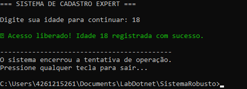
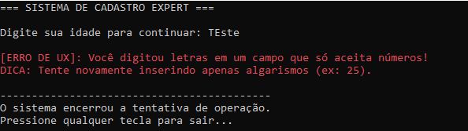

# 🛡️ Prevenção de Erros com Try-Catch

O **try-catch** é uma estrutura usada para tratar erros durante a execução de um programa, evitando que ele pare de funcionar inesperadamente.

## 🔗 Relação com a Prevenção de Erros

A heurística de **Prevenção de Erros** de Nielsen defende que o sistema deve evitar erros sempre que possível.  
O **try-catch** ajuda nisso ao capturar falhas e permitir que o sistema continue funcionando de forma controlada, oferecendo feedback claro ao usuário.

## 📸 Evidência de Execução

